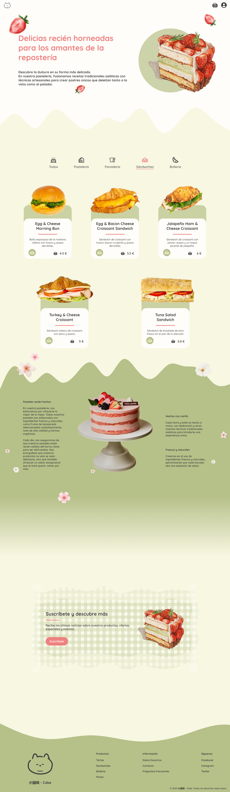
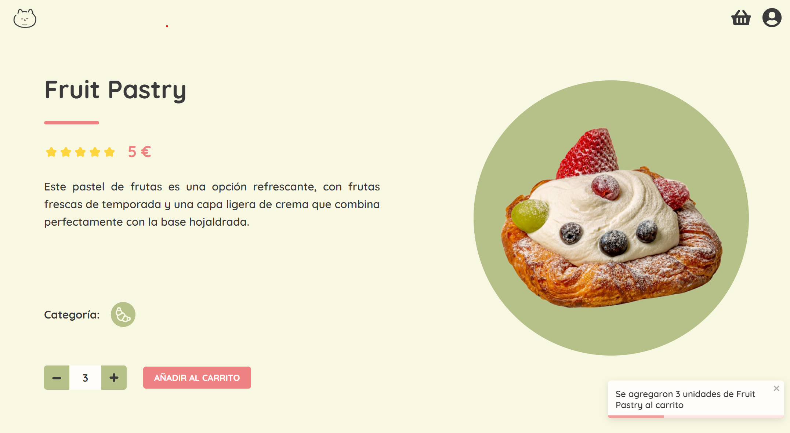
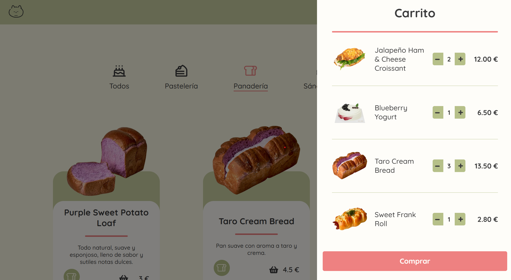
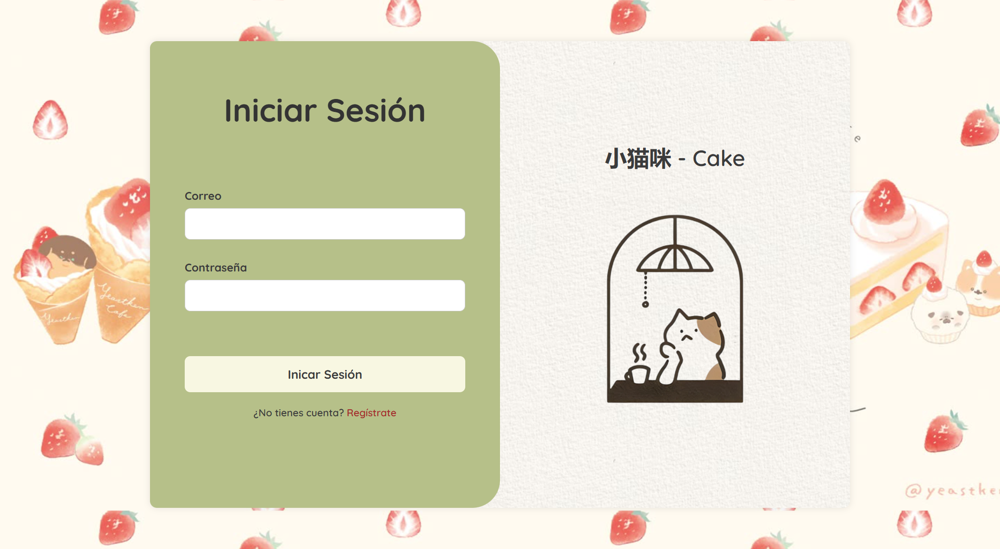
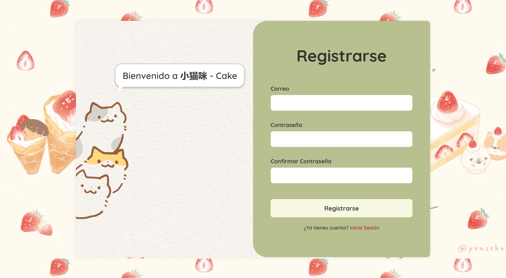

# 小猫咪 - Cake

This project is a website for a bakery, built with React, offering users the ability to browse and purchase delicious baked goods online.

## Theme and Inspiration

The design of this online bakery is inspired by a very cute and cozy Asian-style pastry shop with floral and fruity touches, aiming to create a warm and inviting digital experience for customers.

## Key Features

* **Product Catalog:** Displays a variety of bakery products on the main page.
* **Category Filter:** Allows users to filter products by category.
* **Shopping Cart:** A dropdown cart that shows selected products, implemented using React Context API and custom hooks.
* **Add to Cart (Main Page):** Users can add products to the cart directly from the main product listing.
* **Product Details Page:** Clicking on a product opens a dedicated page with detailed information.
* **Quantity Selection:** On the product details page, users can specify the desired quantity.
* **"Added to Cart" Message:** Confirmation message displayed using `react-toastify` when a product is added to the cart.
* **Local Storage Cart:** The contents of the shopping cart are saved in the browser's local storage, persisting across sessions.
* **Login:** Allows existing users to log into their accounts (located in the header).
* **Registration:** Enables new users to create an account (located in the header).

## Technologies

This website is built using the following main technologies:

* **Frontend:** `React`
* **State Management:** `React Context API` with custom hooks (`useCart`, `useFilter`)
* **Notifications:** `react-toastify` for displaying toast notifications
* **Data Storage:** Product data stored in a `JSON` file

(Once you provide the full project structure, we can add more specific dependencies.)

## Main Components

1. **Main Page:** Displays a variety of bakery products with a category filter. Users can add products to the cart directly from this page.

    

2. **Product Details Page:** Shows detailed information about a selected product, including quantity selection and an "Add to Cart" button.

    

3. **Shopping Cart:** A dropdown accessible from the header, displaying the selected products.

    

4. **Login:** Screen for existing users to log in.

    

5. **Registration:** Screen for new users to create an account

    

## Functionality Breakdown

### Main Page

* Displays a list of available bakery products fetched from a `JSON` data file.
* Includes a filtering mechanism that allows users to view products based on different categories. This functionality is managed by the `useFilter` custom hook.
* Provides an "Add to Cart" button for each product, allowing quick addition to the shopping cart. This action utilizes the `useCart` custom hook and displays a notification using `react-toastify`.

### Product Details Page

* Accessible by clicking on a product from the main page.
* Shows detailed information about the selected product fetched from the `JSON` data.
* Allows users to select the quantity they want to add to their cart.
* Features an "Add to Cart" button.
* Upon successfully adding a product to the cart (using the `useCart` hook), a confirmation message is displayed using `react-toastify`.

### Shopping Cart

* Implemented as a dropdown accessible from the website's header.
* Displays the products that have been added to the cart, managed through the `useCart` custom hook and React Context API.
* The cart's data (including quantities) is stored in the browser's **local storage** using `useEffect` within the `CartProvider`, ensuring that the cart persists even if the user closes the browser or navigates away from the site.

### Login and Register

* Includes dedicated pages or components for user login and registration, accessible through links or buttons in the website's header.
* Allows users to create new accounts and log in.
